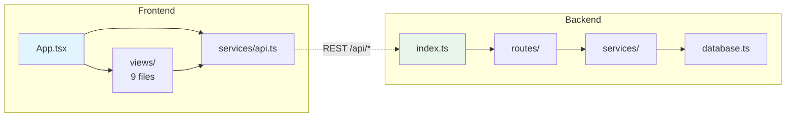

# Codebase Outliner

Scan and outline any project's structure, file dependencies, API endpoints, and API call references -- exported as a Markdown file with Mermaid diagrams.

Works with **any AI coding agent**: Claude Code, GitHub Copilot, Cursor, Windsurf, Aider, and others.

## What It Does

Runs a 7-phase analysis on one or more project directories:

1. **Discovery** -- Detects project roles (frontend/backend) and frameworks from `package.json`, `requirements.txt`, etc.
2. **Structure Scan** -- Builds annotated file trees, flags entry points, route files, and service layers
3. **Dependency Analysis** -- Maps internal imports to produce a file dependency graph
4. **API Endpoint Detection** -- Finds backend route definitions (method, path, file, handler, middleware)
5. **API Call Detection** -- Finds frontend HTTP calls (fetch, axios, etc.) with base URL resolution
6. **Cross-Reference** -- Matches frontend calls to backend endpoints; flags unmatched and unused routes
7. **Output** -- Generates a single `.md` file with tables, Mermaid diagrams, and an architecture overview

## Supported Frameworks

| Layer | Frameworks |
|-------|-----------|
| Frontend | React, Vue, Angular, Svelte, Next.js, Nuxt |
| Backend | Express, Koa, Hono, Flask, FastAPI, Django, NestJS, Ruby on Rails |
| Languages | JavaScript, TypeScript, Python, Go, Rust |

## Installation

### Claude Code

Clone into the skills directory:

```bash
# macOS / Linux
git clone https://github.com/maomaoc474/codebase-outliner ~/.claude/skills/outliner

# Windows
git clone https://github.com/maomaoc474/codebase-outliner %USERPROFILE%\.claude\skills\outliner
```

Restart Claude Code. The skill triggers automatically when you ask to outline a project.

### GitHub Copilot

Copy the adapter and supporting files into your project:

```bash
# Copy the Copilot instructions file
cp codebase-outliner/.github/copilot-instructions.md YOUR_PROJECT/.github/copilot-instructions.md

# Copy the core prompt and reference files
cp codebase-outliner/PROMPT.md YOUR_PROJECT/PROMPT.md
cp -r codebase-outliner/references YOUR_PROJECT/references
```

Then ask Copilot to "outline this project".

### Cursor

Copy the rules file and supporting files into your project:

```bash
mkdir -p YOUR_PROJECT/.cursor/rules
cp codebase-outliner/.cursor/rules/outliner.mdc YOUR_PROJECT/.cursor/rules/outliner.mdc

# Copy the core prompt and reference files
cp codebase-outliner/PROMPT.md YOUR_PROJECT/PROMPT.md
cp -r codebase-outliner/references YOUR_PROJECT/references
```

Then ask Cursor to "outline this project".

### Windsurf

Copy the rules file and supporting files into your project:

```bash
cp codebase-outliner/.windsurfrules YOUR_PROJECT/.windsurfrules

# Copy the core prompt and reference files
cp codebase-outliner/PROMPT.md YOUR_PROJECT/PROMPT.md
cp -r codebase-outliner/references YOUR_PROJECT/references
```

Then ask Windsurf to "outline this project".

### Any Other Agent

The core instructions are in [`PROMPT.md`](PROMPT.md) -- a self-contained, agent-agnostic markdown file. Point your agent at it however your tool supports custom instructions. The two files in [`references/`](references/) provide detection patterns and the output template.

## Usage

Ask your AI agent in natural language:

```
outline this project
```

```
map the file dependencies and API connections
```

```
diagram the architecture of ./frontend and ./backend
```

The agent generates a `PROJECT-OUTLINE.md` in your current directory (or wherever you specify).

## Example Output

The generated outline includes:

### Tech Stack Table

| Layer | Technology | Version | Purpose |
|-------|-----------|---------|---------|
| Frontend | React | 18.x | SPA UI framework |
| Backend | Express | 4.x | REST API server |
| Database | PostgreSQL | 16.x | Persistence |

### File Dependency Graph (Mermaid)



### API Endpoint Table

| # | Method | Path | File | Middleware |
|---|--------|------|------|-----------|
| 1 | POST | /api/auth/login | routes/auth.ts:42 | -- |
| 2 | GET | /api/users | routes/user.ts:8 | auth |

### API Cross-Reference Diagram

Frontend calls are matched to backend endpoints, with unmatched calls and unused endpoints flagged separately.

## Multi-Project Support

Point the outliner at multiple directories and it will:
- Scan each project independently
- Use Mermaid subgraphs per project
- Cross-reference API calls across projects
- Highlight cross-project imports with dashed arrows

## Large Project Handling

For projects with 100+ source files:
- Directory structure grouped at top 2 levels
- Dependency graph grouped by module, not individual files
- Every API endpoint and call is still itemized (highest-value output)

## How It Works

The agent uses its file search and reading capabilities to scan your project. No external dependencies, no build step, no configuration. The detection patterns cover 10+ frameworks and are defined in [`references/detection-patterns.md`](references/detection-patterns.md). The output follows the template in [`references/output-template.md`](references/output-template.md).

## Repo Structure

```
codebase-outliner/
├── PROMPT.md                          # Agent-agnostic instructions (universal)
├── SKILL.md                           # Claude Code native skill format
├── references/
│   ├── detection-patterns.md          # Regex patterns for 10+ frameworks
│   └── output-template.md            # Output structure template
├── .github/
│   └── copilot-instructions.md        # GitHub Copilot adapter
├── .cursor/
│   └── rules/outliner.mdc            # Cursor adapter
├── .windsurfrules                     # Windsurf adapter
├── README.md
└── LICENSE
```

## License

MIT
