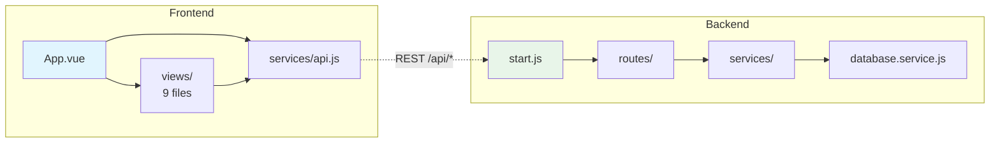

# Outliner - Claude Code Skill

Scan and outline any project's structure, file dependencies, API endpoints, and API call references -- exported as a Markdown file with Mermaid diagrams.

## What It Does

The outliner skill runs a 7-phase analysis on one or more project directories:

1. **Discovery** -- Detects project roles (frontend/backend) and frameworks from `package.json`, `requirements.txt`, etc.
2. **Structure Scan** -- Builds annotated file trees, flags entry points, route files, and service layers
3. **Dependency Analysis** -- Maps internal imports to produce a file dependency graph
4. **API Endpoint Detection** -- Finds backend route definitions (method, path, file, handler, middleware)
5. **API Call Detection** -- Finds frontend HTTP calls (fetch, axios, etc.) with base URL resolution
6. **Cross-Reference** -- Matches frontend calls to backend endpoints; flags unmatched and unused routes
7. **Output** -- Generates a single `.md` file with tables, Mermaid diagrams, and an architecture overview

## Supported Frameworks

| Layer | Frameworks |
|-------|-----------|
| Frontend | React, Vue, Angular, Svelte, Next.js, Nuxt |
| Backend | Express, Koa, Hono, Flask, FastAPI, Django, NestJS, Ruby on Rails |
| Languages | JavaScript, TypeScript, Python, Go, Rust |

## Installation

Clone this repo into your Claude Code skills directory:

```bash
# macOS / Linux
git clone https://github.com/YOUR_USERNAME/claude-skill-outliner ~/.claude/skills/outliner

# Windows
git clone https://github.com/YOUR_USERNAME/claude-skill-outliner %USERPROFILE%\.claude\skills\outliner
```

Or download and copy the files manually into `~/.claude/skills/outliner/`.

### Verify

After installation, the skill directory should look like:

```
~/.claude/skills/outliner/
├── SKILL.md
└── references/
    ├── detection-patterns.md
    └── output-template.md
```

Restart Claude Code. The skill activates automatically when you ask to outline or diagram a project.

## Usage

Just ask Claude Code in natural language:

```
outline this project
```

```
map the file dependencies and API connections
```

```
diagram the architecture of ./frontend and ./backend
```

The skill generates a `PROJECT-OUTLINE.md` in your current directory (or wherever you specify).

## Example Output

The generated outline includes:

### Tech Stack Table

| Layer | Technology | Version | Purpose |
|-------|-----------|---------|---------|
| Frontend | Vue 3 | 3.5.x | SPA UI framework |
| Backend | Express | 5.1.0 | REST API server |
| Database | SAP HANA | -- | Persistence |

### File Dependency Graph (Mermaid)



### API Endpoint Table

| # | Method | Path | File | Middleware |
|---|--------|------|------|-----------|
| 1 | POST | /api/auth/login | routes/auth.js:42 | -- |
| 2 | GET | /api/users | routes/user.js:8 | auth |

### API Cross-Reference Diagram

Frontend calls are matched to backend endpoints, with unmatched calls and unused endpoints flagged separately.

## Multi-Project Support

Point the skill at multiple directories and it will:
- Scan each project independently
- Use Mermaid subgraphs per project
- Cross-reference API calls across projects
- Highlight cross-project imports with dashed arrows

## Large Project Handling

For projects with 100+ source files:
- Directory structure grouped at top 2 levels
- Dependency graph grouped by module, not individual files
- Every API endpoint and call is still itemized (highest-value output)

## How It Works

The skill uses Claude Code's built-in tools (Glob, Grep, Read) to scan your project. No external dependencies, no build step, no configuration. The detection patterns cover 10+ frameworks and are defined in [`references/detection-patterns.md`](references/detection-patterns.md). The output follows the template in [`references/output-template.md`](references/output-template.md).

## License

MIT
